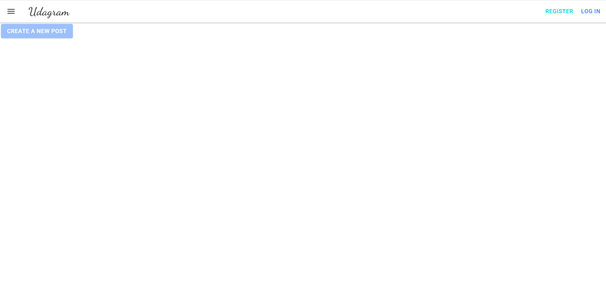
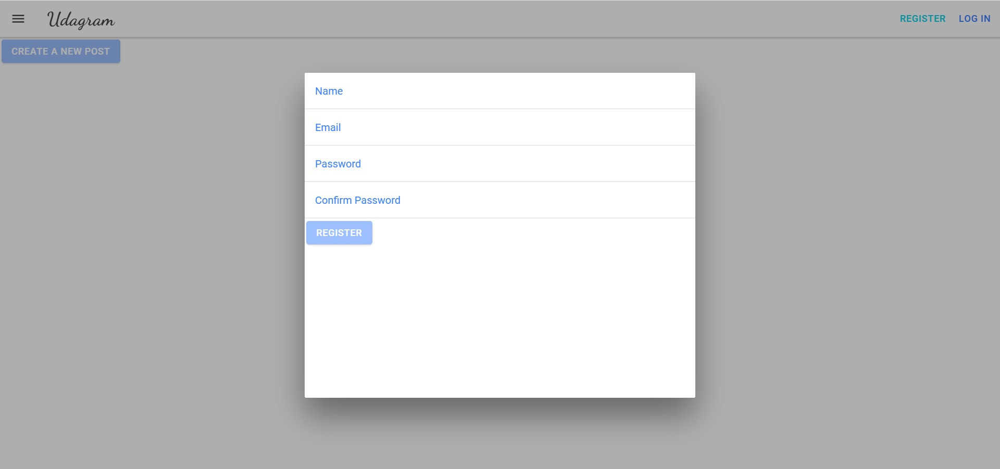
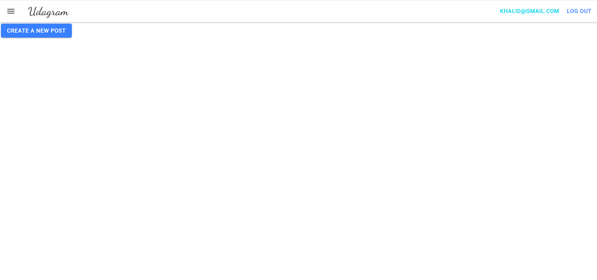

# Udagram Deployment

A newly developed application to test the deployment process on Amazon Web Services including: `AWS RDS`, `AWS S3`, and `AWS Elastic Beanstalk`.

## Get Started

You can access the application through [this link](http://udagram-deployment.s3-website-us-east-1.amazonaws.com/).

The homepage should look like this:

To use the app, you can register for a free account by clicking on the `Register` button on the top-right of the homepage. You will be required to fill the following fields:

After registering, you will be automatically signed-in to your account as in the following screenshot:

Your credentials are now saved on the database. You can Log out and sign-in again anytime.

## Environment

- Node v14.15.1 (LTS)
- npm 8.11.0 (LTS)
- Angular
- AWS CLI v2
- AWS S3
- AWS RDS
- AWS Elastic Beanstalk
- CircleCi
