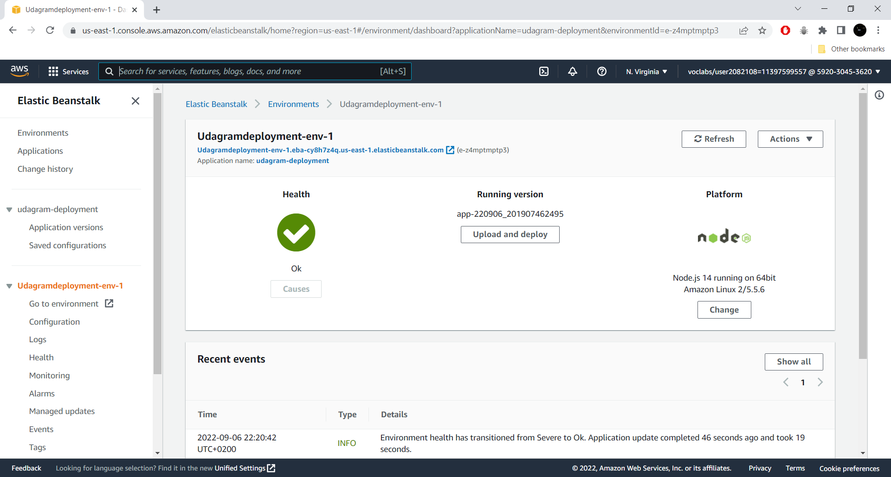
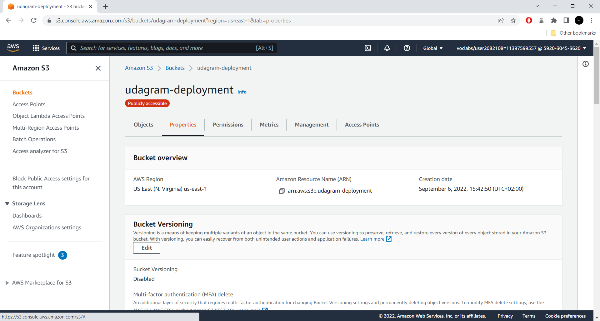
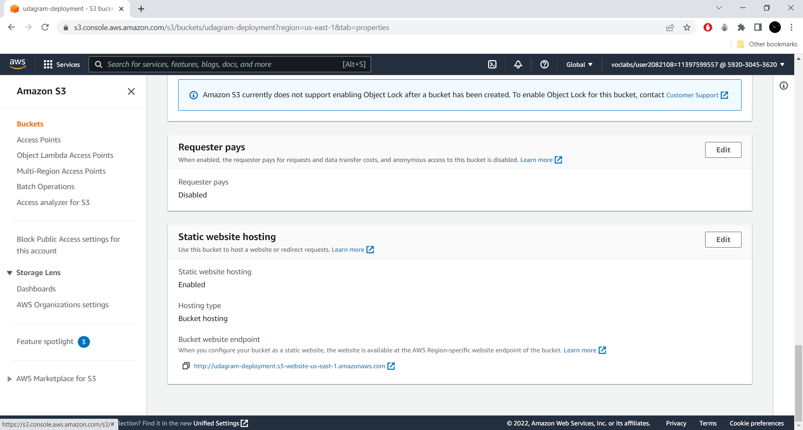
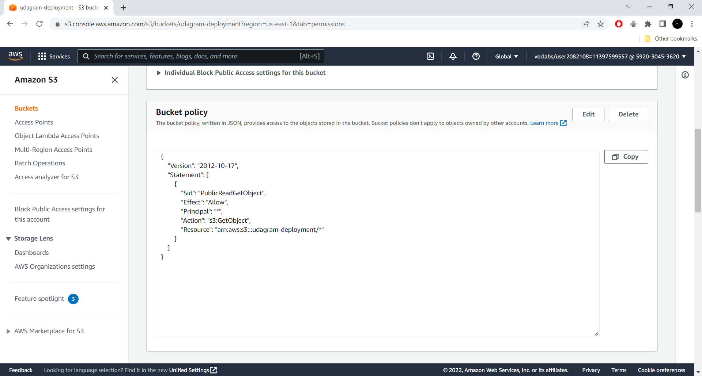
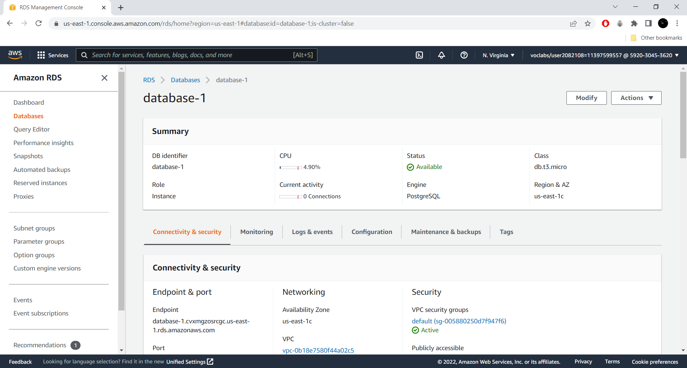
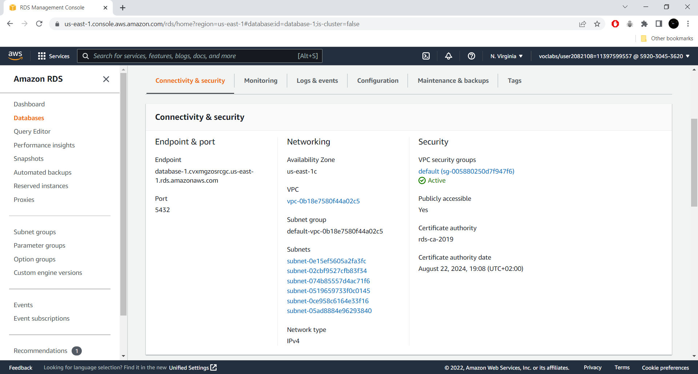
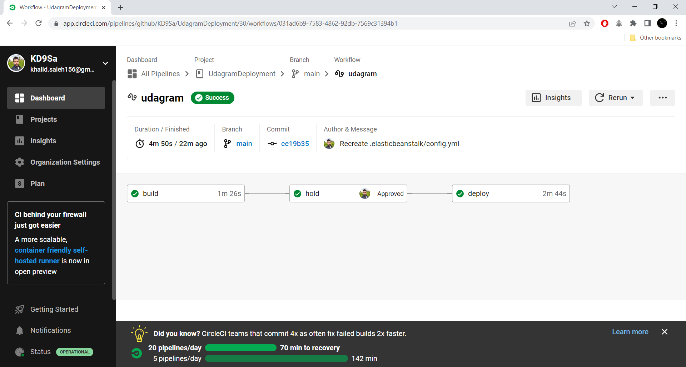
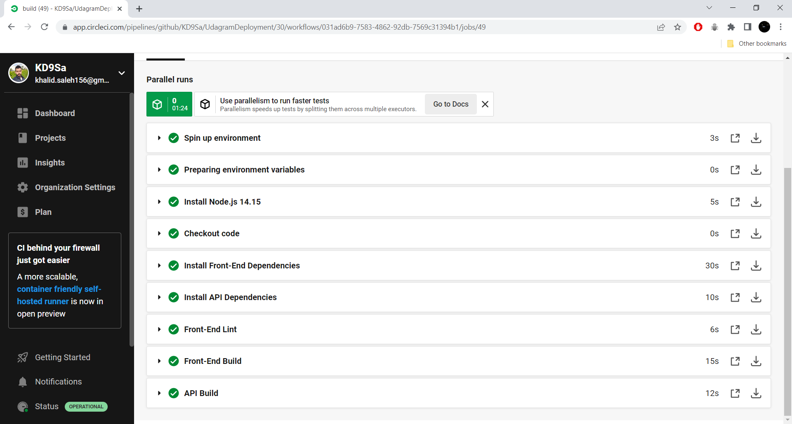
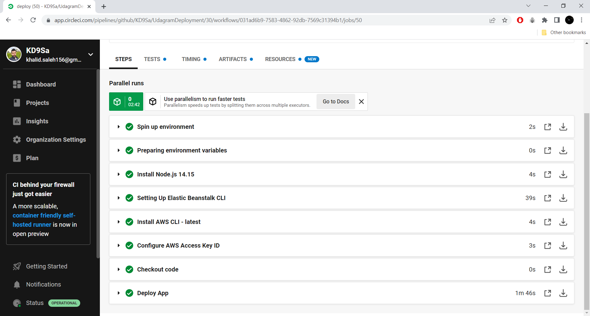

# Infrastructure Description

The application is divided into two main folders: `udagram-api` for the backend and `udagram-frontend` for the frontend. Each folder contains its own configuration files including: `package.json`, `eslintrc.json`, and `.gitignore`.

## Technologies

There are various technologies used in the app, but the main ones are:

- **Backend:** `Node.js`, `Express`, `TypeScript`.
- **Frontend:** `Angular`, `HTML`, `CSS`.
- **Database:** `PostgreSQL`

 

## Deployment

The services used for deployment process are:

- **Backend:** `AWS Elastic Beanstalk`
- **Frontend:** `AWS S3`
- **Database:** `AWS RDS`

The services communicate with each other as in the following diagram:

 

## Screenshots

- **AWS Elastic Beanstalk:**

 

- **AWS S3:**

 

- **AWS RDS:**

 

- **CircleCi:**

